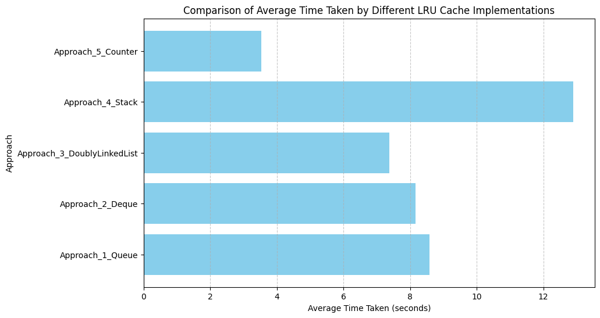

# Multi-Method LRU Cache Evaluation

This repository contains a comprehensive analysis of the LRU (Least Recently Used) Cache implemented using five different methods. The goal of this analysis is to compare the performance of each approach in terms of average time taken to execute cache operations.

## Methods Implemented

The following methods have been implemented to build the LRU Cache:

1. **Approach_1_Queue**: Implementation using a queue data structure to maintain the order of cache items.
2. **Approach_2_Deque**: Implementation using a deque (double-ended queue) for efficient removal and addition of elements at both ends.
3. **Approach_3_DoublyLinkedList**: Implementation using a custom doubly linked list, which allows quick access, insertion, and deletion of nodes.
4. **Approach_4_Stack**: Implementation using a stack, though less common for LRU, it's used for the sake of comparative analysis.
5. **Approach_5_Counter**: Implementation using counters to track the usage frequency of cache items.

## Performance Analysis

Each implementation was tested on a large dataset, with approximately 890,000 operations performed for each method. The average time taken by each implementation is summarized below:

| Method                      | Average Time Taken (seconds) |
|-----------------------------|------------------------------|
| Approach_1_Queue            | 8.58                         |
| Approach_2_Deque            | 8.17                         |
| Approach_3_DoublyLinkedList | 7.37                         |
| Approach_4_Stack            | 12.90                        |
| Approach_5_Counter          | 3.54                         |

### Observations

- The **Counter** approach is the fastest in average cases, making it efficient for scenarios with high frequency operations.
- The **DoublyLinkedList** implementation, while being slower compared to other methods, is a widely accepted solution on platforms like LeetCode due to its robustness and ability to handle edge cases efficiently.
- The **Queue**, **Deque**, and **Stack** implementations provide a balance between simplicity and performance, with the **Stack** being the slowest in this comparison.

## Plot of Average Time Taken

Below is a horizontal bar plot representing the average time taken by each approach:

## Conclusion

This analysis highlights the trade-offs between different LRU Cache implementations. While some approaches may be faster in general cases, they may struggle with specific edge cases. The **Counter** approach, despite its efficiency, may encounter performance issues with edge cases, whereas the **DoublyLinkedList** approach, although slower here, is robust and widely accepted.

## Future Work

- Exploration of hybrid approaches combining the strengths of multiple methods.

## How to Run the Code

1. Clone this repository.
2. Navigate to the directory containing the LRU Cache implementation files.
3. Execute the respective C++ or Python files to run the analysis.

## Author

I conducted this analysis focusing on the comparative performance of different LRU Cache implementation methods.
